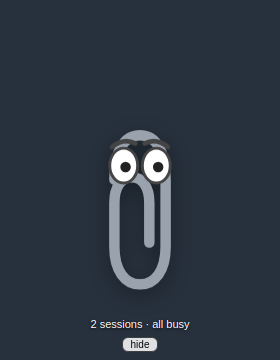
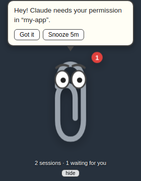
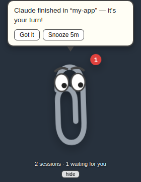

# 📎 Clippy for Claude Code

A little Clippy that lives on your MacBook, watches your Claude Code sessions,
and bounces at you when one of them needs you.

> *"Hey! Claude needs your permission in “my-app”."*

| Watching, all busy | Needs your permission | Claude finished |
|---|---|---|
|  |  |  |

*(Real captures of the app driven by simulated hook events — regenerate with
`xvfb-run npx electron scripts/demo-screenshots.js`. On your Mac the dark
backdrop is transparent: just Clippy floating over your windows.)*

You kick off a long Claude Code task, switch to Slack, and twenty minutes later
discover it's been sitting at a permission prompt the whole time. Clippy fixes
that: a floating, draggable paperclip (always on top, on every Space) that
knows the live state of every session — and it doesn't give up, re-nudging
every 90 seconds until you respond, snooze, or dismiss.

## How it works

```
Claude Code session(s)
   │  hooks: Notification / Stop / UserPromptSubmit / SessionStart / SessionEnd
   ▼  curl POST → http://127.0.0.1:43117/hook/<event>
Clippy app (Electron)
   ├─ session tracker: who's working, waiting, or blocked on permission
   ├─ floating Clippy: bounce + speech bubble + reminder loop + snooze
   ├─ native macOS notifications (clickable)
   └─ menu bar item 📎 with a count of sessions waiting on you
```

Claude Code's [hooks](https://code.claude.com/docs/en/hooks) fire shell
commands on lifecycle events. The installer registers six tiny `curl` hooks in
`~/.claude/settings.json` that POST each event's JSON to the app on localhost:

| Hook event | Clippy reaction |
|---|---|
| `Notification` (`permission_prompt`) | 🔴 Urgent bounce — Claude is blocked on a permission |
| `Notification` (`idle_prompt`) | 🟡 Reminder — Claude has been waiting for your reply |
| `Stop` | 🟡 "Claude finished — your turn!" |
| `UserPromptSubmit` | clears the alert for that session (you're on it) |
| `SessionStart` / `SessionEnd` | tracks sessions appearing/disappearing |

The hooks are no-ops when Clippy isn't running (`curl -m 2 … || true`), so
they never slow down or break Claude Code.

## Quick start

```bash
npm install            # pulls Electron
npm run hooks:install  # registers hooks in ~/.claude/settings.json
npm start              # Clippy appears bottom-right; 📎 appears in the menu bar
```

Restart any already-running Claude Code sessions so they pick up the hooks,
then ask Claude to do something that needs permission — Clippy will let you
know.

## Using it

- **Drag Clippy** anywhere; he floats above full-screen apps on all Spaces.
- **Click Clippy** to re-open the latest message.
- **Got it** acknowledges everything; **Snooze 5m** pauses the nagging.
- The red badge and the menu bar `📎 N` show how many sessions need you.
- **hide** (hover below Clippy) hides the window; bring it back from the
  menu bar. Quit from the menu bar too.
- Works with any number of parallel sessions — each is tracked by
  `session_id` and named after its project directory.

## Configuration

| What | How |
|---|---|
| Port (default `43117`) | `CLIPPY_PORT=5005 npm start` and `npm run hooks:install -- --port 5005` |
| Inspect live state | `curl localhost:43117/status` |
| Check installed hooks | `npm run hooks:status` |
| Remove hooks | `npm run hooks:uninstall` (only touches entries tagged `#claude-clippy`) |

## Development

```bash
npm test   # node:test suite for the server, session tracker, and hook installer
```

- `src/server.js` — dependency-free localhost HTTP server for hook events
- `src/sessions.js` — session state machine; turns hook events into reactions
- `src/main.js` — Electron main: window, tray, notifications
- `src/renderer/` — the Clippy himself (hand-drawn SVG, blinks, bounces)
- `bin/clippy-hooks.js` — hook installer/uninstaller for `~/.claude/settings.json`

## Security notes

The hook server binds to `127.0.0.1` only and accepts nothing but hook event
JSON; nothing is exposed to the network and no session content leaves your
machine.
