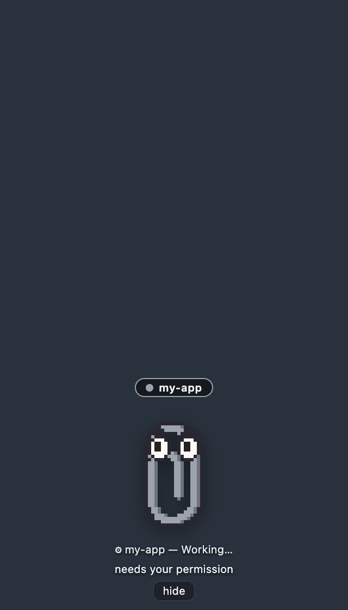
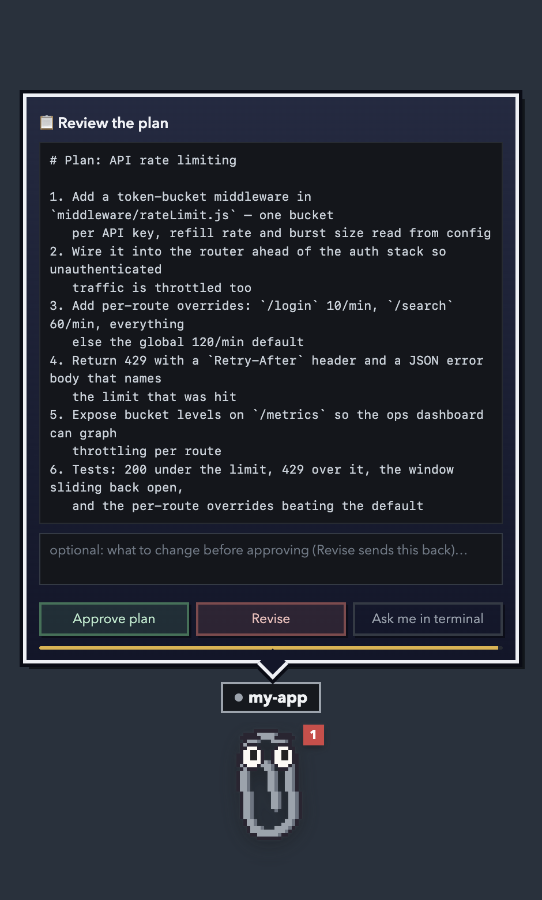
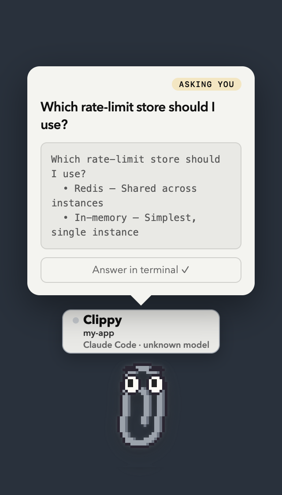
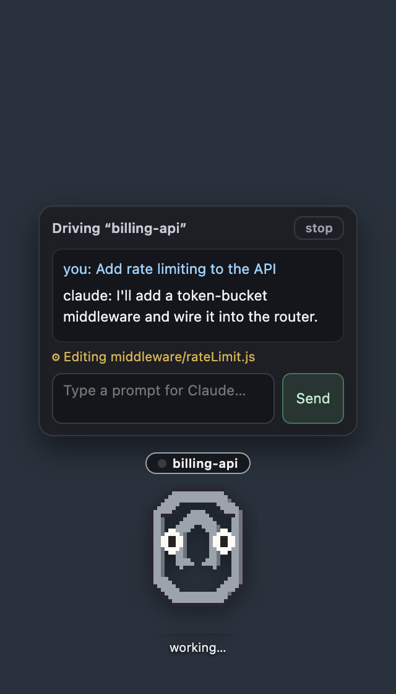
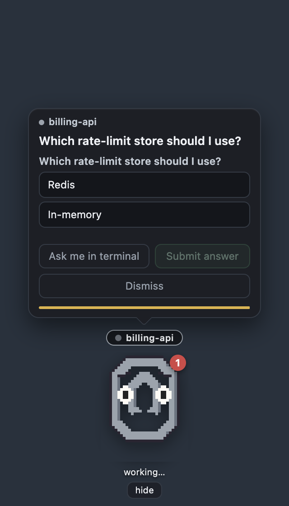

# 📎 Clippy for Claude Code + Codex

By [AI Socratic](https://aisocratic.org).

**One little Clippy per Claude Code or Codex session**, living on your MacBook, each one
knowing what its session is doing right now — and letting you **answer it right
there**: approve or deny permission requests, approve or revise a plan, pick an
answer to Claude's question, and review the work when it finishes. No hunting
through terminal tabs.

> *"Hey! Claude wants to run `rm -rf /tmp/build` in “my-app” — allow it?"*

| Approve or deny | Approve or revise a plan | Answer a question |
|---|---|---|
|  |  |  |

Each buddy wears a **name plate** with its character name, project, and the harness + model
running it (`Pixel cat` / `my-app` / `Codex · gpt-5.5`, for example), and its own
colour. Concurrent agents in the same folder are assigned different available buddy
animations, so five parallel agents are distinguishable characters rather than one confused paperclip. A live
**activity line** under each shows what that session
is doing — `⚙ my-app — Running: npm test`, `✏ Editing server.js`,
`✓ done — your turn`, `⚠ Bash failed`.

*(Real captures of the app driven by simulated hook events — regenerate with
`npx electron scripts/demo-screenshots.js`, or under `xvfb-run` on Linux. The
dark backdrop stands in for your desktop: the real window is transparent.)*

You kick off a long coding-agent task, switch to Slack, and twenty minutes later
discover it's been sitting at a permission prompt the whole time. Clippy fixes
that: floating, draggable paperclips (always on top, on every Space) that know
the live state of every session — and they don't give up, re-nudging every 90
seconds until you respond, snooze, or dismiss.

**Clippy stays hidden while Claude works.** A buddy only appears when its
session actually wants you — it finished a turn, needs a permission or plan
approved, or is asking a question — and slips away again the moment you've
answered or typed a new prompt in the terminal. Nothing pops up for ordinary
tool activity. Show any buddy on demand from the 📎 menu bar (it then stays put
until you hide it).

And it shows up **where the session lives**: when a buddy has something to say
it appears on that session's own terminal/editor window — top-right corner,
following the window as you move it — rather than in a corner of the screen.
Every card carries a **go to terminal ↗** button that brings that window to the
front, so you land in the right session instead of hunting for it.

Clippy is a **small buddy** by default and only grows a window when there's
something to read — as tall as that thing needs, no more. **Click him** and he
goes straight to the useful thing: a message you haven't seen yet, or — when
there's nothing waiting — one panel that answers "how is this session doing,
and what now?": what the agent is doing right now, how much context and
allowance it has spent (`660k left of 1.0M · 340k used (34%)` over a progress
bar, plus real allowance bars for the rolling 5-hour block, the week, and
Opus's own week once you tell Clippy your plan), and a box to type the next
prompt into — he raises that session's terminal and types it in for you.
**Right-click** for everything else — the same stats, Settings, and hide.
**Double-click** just says hi back, for about a second. The buddies are **pixel
art**: Clippy himself in your session's colour, a pixel cat, and Clod, all drawn in
code with no image assets in the repo — and any sprite pack you drop in,
swappable from the menu.

## How it works

```
Claude Code / Codex session(s)
   │  hooks: PermissionRequest / Stop / Pre+PostToolUse / Notification / Session*
   ▼  curl POST → http://127.0.0.1:43117/hook/<event>   (response = hook decision)
Clippy app (Electron)
   ├─ session tracker: who's working, waiting, blocked — and what they're doing now
   ├─ decision broker: holds interactive hooks open until you click (or timeout)
   ├─ one floating Clippy per session (hidden until it needs you): name plate, activity line,
   │    approval/plan/question/review cards, snooze
   ├─ native macOS notifications (clickable)
   └─ menu bar item 📎 with a count of sessions waiting on you
```

Claude Code and Codex lifecycle hooks fire shell
commands on lifecycle events, and a hook's stdout JSON can *answer* the event.
The installer registers tiny `curl` hooks in `~/.claude/settings.json` and
`~/.codex/hooks.json` that POST each event's JSON to the app on localhost. Interactive hooks are
interactive — their HTTP response is the hook's decision:

| Hook event | Clippy reaction |
|---|---|
| `PermissionRequest` | 🛂 **Approval card** — Allow / Deny (with a reason Claude sees) / send to terminal. For `ExitPlanMode` it becomes a **plan card**: Approve / Revise (your note sends Claude back to planning) |
| `Stop` | ✅ **Review card** — "Looks good" lets Claude stop; typed feedback sends it back to work |
| `PreToolUse` *(AskUserQuestion)* | ❓ **Question card** — Claude's options as buttons. What you pick is fed straight back, so the terminal picker never appears |
| `PreToolUse` *(Bash, Edit, Write, Web*, Task, …)* | ⚙ **Activity line** — what Claude is doing now |
| `PostToolUse` *(same tools)* | ✓ marks the action done |
| `PostToolUseFailure` *(same tools)* | ⚠ surfaces the failure and its first error line |
| `Notification` (`permission_prompt`) | 🔴 Urgent bounce — a prompt is waiting in the terminal |
| `Notification` (`idle_prompt`) | 🟡 Reminder — Claude has been waiting for your reply |
| `UserPromptSubmit` | clears alerts & pending cards for that session (you're on it) |
| `SessionStart` / `SessionEnd` | tracks sessions appearing/disappearing — a fresh session or `/clear` also nudges you to calibrate your plan, once a day, until you do |

The activity hooks match **only meaningful tools** (`Bash|Edit|Write|…|mcp__.*`)
— `Read`, `Grep`, `Glob`, and `TodoWrite` are excluded, so the noisy read-only
tools never even fire a hook (no latency, no spam).

**How answering a question works:** the `PreToolUse` hook can rewrite a tool's
arguments before it runs (`permissionDecision: "allow"` + `updatedInput`). An
`AskUserQuestion` whose input already carries an `answers` map has nothing left
to ask, so filling it in *is* the answer — Claude Code prints
`User answered Claude's questions: · Which store? → Redis` and the terminal
picker never appears. Multi-select answers are the chosen labels comma-joined,
and an answer that isn't one of the offered options is read as a typed "Other".

If you don't answer in Clippy (dismiss, timeout, app not running), the hook
returns `{}` and the normal terminal picker comes up exactly as before.

Safety properties of the interactive hooks:

- `PermissionRequest` fires **only when Claude Code would actually show a
  permission prompt** — allowlisted commands run at full speed, untouched.
- If you don't answer in time (60s for approvals, 30s for reviews — typing
  extends the hold), Clippy answers "no decision" and the normal terminal
  prompt takes over. Nothing is ever auto-approved.
- When the app isn't running, the hooks fail instantly
  (`--connect-timeout 1 … || true`) and Claude Code behaves exactly as if
  Clippy didn't exist.
- Both behaviors can be toggled from **📎 menu bar → Quick settings**
  ("Permission requests" / "Review when Claude finishes"), and the toggles persist.

### Codex support

Codex uses its native [lifecycle hooks](https://learn.chatgpt.com/docs/hooks) and reports into the
same local server. Clippy tracks Codex sessions, tool activity, permission requests, completed
turns, terminal windows, review feedback, and token/context totals from local rollout transcripts.
The permission and `Stop` decision formats are compatible with the Claude path, so Allow, Deny,
Looks good, and Send feedback work from the same cards.

There are three deliberate differences in the current Codex integration:

- Codex has no `Notification` or `PostToolUseFailure` hook. Clippy detects non-zero shell exits
  from `PostToolUse`, while idle reminders rely on the turn/question/permission hooks it does have.
- A Codex `request_user_input` call is surfaced as a read-only question card that takes you to the
  native picker. Claude's `AskUserQuestion` hook can still be answered directly inside Clippy.
- Drive mode and Claude plan/allowance calibration remain Claude-specific. Codex context and token
  totals are shown from its rollout files without pretending they are account-limit percentages.

### OpenClaw support

[OpenClaw](https://openclaw.ai) sessions get a buddy too, in **watch mode only**: the buddy shows
an activity line while the gateway works and nudges you when a reply lands, but there are no
interactive cards (no permission/review/question buttons) in this integration yet.

```bash
npm run hooks:install -- --agent openclaw
```

This copies a dependency-free handler to `~/.openclaw/hooks/clippy-hook.mjs` and registers it in
`~/.openclaw/openclaw.json` (`hooks.internal.handlers`, for the `message` and `command` event
families). Restart the OpenClaw gateway to load it. The plain `npm run hooks:install` also picks
OpenClaw up automatically when `~/.openclaw` exists. The handler fires and forgets with a 1s
timeout, so a stopped Clippy never slows the gateway down.

## Quick start

```bash
npm install            # pulls Electron
npm run hooks:install  # registers Claude + Codex hooks in both user config files
npm start              # Clippy appears bottom-right; 📎 appears in the menu bar
```

Restart any already-running agent sessions so they pick up the hooks. Codex requires one extra
trust step: open `/hooks`, review the new Clippy definitions, and trust them. Then ask either agent
to do something that needs permission — Clippy will let you know.

Use `npm run hooks:install -- --agent claude` or `--agent codex` to install only one integration.
The matching options also work with `hooks:status` and `hooks:uninstall`.

## Installing the app

`npm start` is fine for development, but you can also build a real, installable
app — still with zero dependencies, the way Electron's docs describe manual
distribution:

```bash
npm run package   # dist/Clippy for Claude Code.app + dist/Clippy-for-Claude-Code.dmg
```

That copies the prebuilt Electron.app out of `node_modules`, puts this app's
source into `Contents/Resources/app/` with the buddy art pre-drawn, rewrites
the bundle's name/identifier/icon, ad-hoc signs it, and wraps it in a .dmg
with an Applications shortcut. Open the .dmg, drag the app across, done.

Two things worth knowing:

- **The app is unsigned** (ad-hoc only — no Apple developer certificate), so
  the first time a *downloaded* copy is opened Gatekeeper will object.
  Right-click the app → **Open** → Open to get the "open anyway" button, or
  clear the quarantine flag yourself:

  ```bash
  xattr -dr com.apple.quarantine "/Applications/Clippy for Claude Code.app"
  ```

  A copy you built on your own machine was never quarantined and opens
  normally.

- **The permission rows finally make sense.** Run from source, macOS
  attributes everything to Electron's own bundle — which is why the
  Accessibility and Automation lists say "Electron" and nobody can find
  Clippy in them. The packaged app is its own bundle
  (`dev.aisocratic.clippy`), so those rows say **Clippy for Claude Code**,
  and its grants don't disappear when Electron updates under `node_modules`.

The hooks are still registered from the checkout (`npm run hooks:install`) —
they just POST to a local port, and the packaged app listens on the same one,
so the two are interchangeable. Run one at a time, though: whoever binds the
port first wins.

## Using it

- **Hidden by default**: a buddy is only on screen when its session is done or
  has something to ask (approval, plan, question, review, or a terminal prompt
  waiting on you). Answer it — or type a new prompt in the terminal — and it
  hides itself again.
- **Activity line**: the small line under Clippy shows what each session is
  doing right now (`⚙ Running: npm test`, `✏ Editing server.js`, `✓ done`,
  `⚠ Bash failed`). Ambient — it never pops the window; you'll see it on the
  buddies you've brought up yourself.
- **Approval card**: when Claude asks for permission, the card shows the exact
  command/edit. **Allow** runs it, **Deny** blocks it (anything you typed in
  the box is sent to Claude as the reason — "use rg instead", "wrong dir"),
  **Ask me in terminal** hands it back to the normal prompt.
- **Plan card**: when Claude presents a plan (plan mode), the card shows the
  plan. **Approve plan** lets it start; type a change and **Revise** to send it
  back to planning with your note.
- **Question card**: when Claude asks a multiple-choice question, its options
  become buttons. Pick one per question (multi-select takes several), hit
  **Submit answer**, and Claude carries on with your choice — no terminal
  round-trip. **Move to terminal ↗** hands the question back to the normal
  picker *and* brings that terminal to the front. (A held question can't be in
  both places at once: while Clippy holds the hook, Claude Code hasn't run the
  tool yet, so there is no picker in the terminal to look at. Releasing it is
  what makes one appear.) If answering from Clippy is off — or the question
  arrives malformed — you get a read-only card with the question and a
  **go to terminal ↗** button instead.
- **Review card**: when Claude finishes, click **Looks good** to let it stop,
  or type what's missing and **Send feedback** — Claude keeps working with
  your note, no terminal round-trip.
- **Perched on your window**: a buddy pops up on the top-right corner of the
  window its session runs in (its editor or terminal), follows it around, and
  leaves when you've answered. Turn it off under **📎 menu bar → Quick settings →
  Perch on the session's own window** if you'd rather they always sit in the
  screen corner.
- **Click Clippy** and he does the one useful thing directly, no menu in the
  way: reopens a message you haven't seen yet, or — if there's nothing
  waiting — opens the **session panel**, which is one click for the three
  things you'd otherwise go looking for separately:
  - **what the agent is doing** — its state and the tool it's on right now
    (`working… · ⚙ Running: npm test`), kept live while the panel is open.
  - **what it has spent** — how much context is **left** in this conversation
    (progress bar turning amber past 60% and red past 85%, 1M window detected
    automatically), then three bars for what every session on this machine has
    spent in the windows `/usage` reports on — the rolling 5-hour block, the
    week across all models, and Opus's own week — plus the models you leaned on
    most. Tell Clippy your plan (Pro, Max 5×, Max 20×, or your own Custom
    numbers) under **Usage & limits** in Settings (📎 in the menu bar) and those
    become real allowance bars, spend over limit; until then they're hatched
    bars showing each window's share of the week, spend with nothing to compare
    it to. Claude Code keeps the real 5-hour/weekly allowances server-side, so
    `/usage` is still the source of truth — Clippy's numbers are for
    calibrating the estimate, not replacing it.
  - **a box to keep chatting** — type what you want and hit Enter: Clippy
    raises that session's terminal and types it onto the prompt line for you
    (simulated keystrokes via the same Accessibility access perching uses,
    flattened to one line since Return submits). Escape closes the panel.

  **Right-click** for the rest, in a short RPG-style menu about *this* session:
  - **📨 See what's waiting** — re-open the latest message, when there is one.
  - **📊 Stats & token usage** — the same panel as a left click.
  - **⚙ Settings…** — opens the settings window (everything that applies to all
    buddies lives there, not here).
  - **× Hide Clippy**.
- **Just being there**: hovering the buddy reveals the name plate above him
  (otherwise hidden so it isn't always taking up room) and the two small
  buttons underneath — **open session ↗** and **hide**. Hovering does nothing
  to the buddy himself: his pose is only ever about the session. A plain click
  gets a quick acknowledging `wave` on top of whatever it just did;
  double-click is purely for fun — a bigger one-off `cheer` for about a second,
  no action attached. Neither ever papers over a real signal — a card, an
  urgent nudge, the stress pose — they only show when there's nothing more
  important going on.
- **Messages you have to act on stay put**: "macOS blocked me from driving that
  window" and friends no longer fade after four seconds — they sit there with an
  **Open Settings ↗** button that takes you straight to Privacy & Security →
  Accessibility (and Clippy opens that pane for you when it hits the wall).
- **“Answer here”**: when a card goes back to the terminal — you clicked
  **Ask me in terminal ↗**, **Move to terminal ↗** or **Answer in terminal ✓**,
  or the hold timed out — and Clippy is already perched on that window, he walks
  down from his corner to the input box at the bottom, stands above it with an
  **answer here ▼** tag for a few seconds, and strolls back to his perch. The
  spot comes from the window's own geometry (bottom-left, above the input box):
  the real cursor lives inside the terminal's text buffer, which nothing outside
  it can read, so this points at the line rather than at the character.
- **One size, always**: the buddy is drawn at the size you picked in every mode
  — a card appearing never shrinks or grows him. Small/Medium/Large are 2×, 3×
  and 4× the 32×40 sprite (pixel art only looks right at whole multiples), and
  the choice sticks across restarts.
- **The menu bar**: click 📎 for the settings window (above); right-click for the
  quick menu — per-session actions (show, perch, open window), Drive mode, every
  on/off switch under *Quick settings* (permission requests, questions, review on
  finish, perch), and quit.
- **go to terminal ↗** (on every card) and **open session ↗** (hover below
  Clippy) both raise that session's window and keep Clippy perched on it as a
  small happy paperclip until you send it away. The menu bar can perch it
  again.
- **The window is only as big as the card**: the renderer measures what it has
  to show and asks for exactly that much height (clamped to your display), so a
  long plan or a queue of approvals isn't cut off and a bare buddy isn't sitting
  in a tall pane of empty glass.
- **Three buddies in the box, more a download away**: 📎 Clippy himself, a
  🐱 pixel cat, and ✳️ **Clod** — a squat terracotta box in the spirit of a
  certain mascot, transcribed into the cast (he was already pixel art) — all **drawn in code**
  — every frame is primitives in
  `scripts/make-buddies.js`, encoded by this repo's own GIF encoder, which is
  what lets Clippy ship with no image assets and no third-party art. Clippy is
  built once per session colour, since a GIF can't be recoloured by CSS. His
  silhouette is traced from the original 1997 paperclip's own path data — one
  continuous wire, round over the top, down both sides, the inner hook left
  open — rather than a blockier stand-in, so there's no separate "classic"
  variant to pick between anymore; `clip` just *is* that shape now.

  All three speak the full **nine-pose vocabulary** — and the buddy picks its own
  pose from what the session is doing:

  | pose | when |
  |---|---|
  | `idle` | quiet |
  | `think` | Claude is working |
  | `excited` | this session wants you — bouncing, with a glow |
  | `stress` | a tool failed, or the context window is past 30% |
  | `walk` | crossing a window on the way to a prompt |
  | `point` | standing on the prompt, pointing at the line |
  | `sleep` | the turn is over, nothing left to do |
  | `cheer` | a turn finished cleanly |
  | `wave` | hello — this session just started |

  `npm run make-buddies` rebuilds them; `node scripts/make-buddies.js --preview
  clip:walk` prints a frame as ASCII if you want to redraw one.
- **Drag Clippy** anywhere; he floats above full-screen apps on all Spaces, and
  he stays put where you dropped him — cards and the right-click menu grow
  around him instead of nudging him sideways.
- **Got it** acknowledges everything; **Snooze 5m** pauses the nagging.
- The red badge and the menu bar `📎 N` show how many sessions need you.
- **hide** (hover below Clippy) hides that buddy early; **Show “name”** in the
  menu bar brings it back and keeps it on screen until you hide it again.
  Quit from the menu bar too.

## One Clippy per session

Every Claude Code session that reports in gets **its own little buddy**, so
parallel agents never fight over one window:

- a **name plate** above each buddy says its character name, which session it's
  watching (the project directory), and the harness + model running it, with a dot that
  pulses while that session is working
- concurrent sessions in the same project use different available character
  animations (until every installed buddy is already on duty)
- each buddy has its own **colour**, derived from the project name, so the same
  project looks the same every run and two agents are rarely twins
- buddies tile from the bottom-right corner leftwards, wrapping onto a row
  above when you run a lot of them
- the status line under each one is about *that* session (`working…`,
  `finished — your turn`, `needs your permission`)
- the menu bar `📎 N` still counts every session waiting on you, and lists them
  so you can bring a specific buddy forward

### Perching on a session's window

Each hook also reports *where* it ran: `TERM_PROGRAM`, the tty of the `claude`
process, and its pid (as `X-Clippy-*` headers, so the hook payload is
untouched). From that Clippy can find the window:

- **Terminal.app / iTerm2** expose a tab's `tty` to AppleScript, so the exact
  tab is selected — not just the app.
- **Everything else** (VS Code, Cursor, Ghostty, WezTerm, Warp, kitty…): Clippy
  walks up the process tree from `claude` to the owning `.app` bundle —
  skipping the windowless Electron helper that editors run terminals in — and
  drives that process through System Events.

The first time it raises or measures a window, macOS asks you to allow Clippy
under **Privacy & Security → Accessibility**; if you decline, Clippy says so
(and the 📎 menu has *Fix window access…*) and stays in its own corner. Older
hook installs don't report any of this, so the buttons stay hidden until you
re-run `npm run hooks:install`.

Two macOS quirks are handled for you: a window that lives on another Space or
in fullscreen isn't in the accessibility list until its app is frontmost (so
"go to terminal" raises the app *first*, then looks), and macOS's `System
Events` helper occasionally wedges and reports *every* app as having zero
windows — Clippy restarts it once and retries rather than concluding your
terminal is gone.

Sessions whose terminal disappears without a `SessionEnd` (a killed tab, a
machine that slept) are swept automatically — after 30 minutes of silence if
they were working, or 6 hours if they were parked waiting on you — so the
count never lies about sessions that no longer exist.

## Drive mode — answer *everything* from Clippy (Agent SDK)

Watch mode reacts to sessions you started in a terminal. **Drive mode** goes
further: Clippy *owns* the session, so it can also send prompts and show a full
transcript. From the 📎 menu bar, **New Clippy-driven session…**
picks a folder and launches a headless Claude session that Clippy runs via
the [Claude Agent SDK](https://code.claude.com/docs/en/agent-sdk). You type
prompts in the GUI and get a streamed transcript — and every interaction is
answerable from Clippy:

| | Drive panel | Answer a question |
|---|---|---|
| |  |  |

The SDK's `canUseTool` callback routes each request to the same cards watch
mode uses — permission requests, plan approvals, and clickable question
options — so the two modes behave identically once a card is on screen.

It's a *separate* headless session from your terminal `claude`, with its own
auth:

- The SDK is an **optional dependency** — install it with
  `npm install @anthropic-ai/claude-agent-sdk` (it bundles the `claude`
  binary). The app runs fine without it; you just can't start a driven session.
- It uses whatever credentials `claude` uses on this machine — your existing
  Claude Code login, `claude setup-token` (`CLAUDE_CODE_OAUTH_TOKEN`), or
  `ANTHROPIC_API_KEY`. **Billing note:** subscription-plan SDK usage draws from
  a separate Agent SDK credit; an API key bills per token. Watch mode (hooks)
  has no such cost — it's just your normal terminal sessions.

### Granting window access (the “I can't find Clippy in Accessibility” bit)

Perching, raising a terminal and walking to a prompt all need macOS
Accessibility. Running from source, **the app is Electron's own bundle**, so the
list in *Privacy & Security ▸ Accessibility* says **Electron**, not "Clippy" —
and it may not be there at all until it's added by hand:

1. Open the settings window (📎 in the menu bar). If access is missing, the
   Sessions section explains it, with the exact path and a **Copy path** button.
2. Hit **Open Accessibility ↗**. Asking is what *puts the app in the list*, so
   usually there's already an **Electron** row waiting to be switched on.
3. If the list still has no entry, click **+**, press ⌘⇧G and paste
   `<repo>/node_modules/electron/dist/Electron.app`, then switch it on.

No restart needed: Clippy watches for the switch and picks up what it was doing.
**No app can add itself** — that list is a SIP-protected database, writable only
by you through System Settings (or an MDM profile on a managed Mac); `tccutil`
can reset permissions but never grant them. Packaging Clippy as a signed `.app`
would at least make the row say "Clippy" instead of "Electron".

## The settings window

Click **📎 in the menu bar** and Clippy's settings window opens (right-click for
the quick menu — sessions, Drive mode, quit). It's the one part of Clippy you sit
and read, and it has five sections:

- **Sessions** — everything reporting in right now, each with the buddy it's
  wearing and a picker to **give that project a buddy of its own**. That choice
  is kept against the project name and becomes the first preference; concurrent
  sessions use the other available characters instead of becoming twins.
- **Buddies** — every character with all nine of its animations playing side by
  side (the same layout as the test bench's workbench), and a size picker.
  **Every live session gets its own available buddy**, chosen from the cast by
  session id, so parallel agents in the same repo do not match. Nothing to
  configure — click a character here to make it the first choice for projects
  currently on screen, or set that preference per project under **Sessions**.
  There's a link to [openpets.dev/gallery](https://openpets.dev/gallery) for
  downloading more.
- **Usage & limits** — turns the token panel's spend bars into real allowance
  bars. Pick your plan (**Pro**, **Max 5×**, **Max 20×**) for a rough estimate
  scaled off Anthropic's own 5×/20× steps, or **Custom** to type in your own
  numbers for the 5-hour block, the week, and Opus's week. To get real numbers:
  run `/usage` in Claude Code, right-click a buddy, and back out the allowance
  from the percentage each side reports (40% in `/usage` against 2.0M in Clippy
  means a ~5M allowance) — type that in under Custom and every bar after that
  is honest instead of a guess. Clippy can't read your plan tier itself —
  Claude Code never persists it anywhere and `/usage` is a live API call that
  leaves no trace on disk — so until you've set one, a new session or `/clear`
  nudges you (once a day) to go run `/usage` and come back with the number.
- **Updates** — which copy you're running (checkout vs packaged app, version,
  commit), and a button that compares it with the tip of `main` on GitHub. The
  one deliberate non-localhost request in the app, made only when you press it.
- **What Clippy can do** — the full catalogue: what triggers each behaviour,
  which hook it rides on, what you see, and — for anything that answers on your
  behalf — **the exact JSON Claude Code receives** for each button. Those strings
  come from the same `toHookResponse` the app answers with (`src/actions.js`), so
  the page can't drift from the behaviour, and a test asserts it.
(Clicking a session's name brings its buddy to the front.)

The on/off switches for what Clippy answers aren't in this window at all: they
live in **📎 menu bar → Quick settings**, one right-click from anywhere. Turn one
off and that moment goes back to the terminal exactly as if Clippy weren't
running — *What Clippy can do* marks the affected entries **off**.

## Bring your own buddy (sprite-sheet themes)

The built-in characters are drawn in code. If you'd rather use a sprite pack
you downloaded, drop it in and Clippy wears it — no code change:

```
src/renderer/assets/themes/my-cat/
├── theme.json
├── idle.png        # a horizontal strip: frame, frame, frame…
└── excited.png
```

```json
{
  "label": "🐈 My cat",
  "frameWidth": 32,
  "frameHeight": 32,
  "fps": 6,
  "idle":    { "file": "idle.png",    "frames": 4 },
  "excited": { "file": "excited.png", "frames": 6 }
}
```

The folder name is the character id, `label` is what the menus show, and each
strip is stepped frame by frame at `fps`. Frames must sit in one horizontal row,
all the same size. Only `idle` is required — anything missing falls back to
`excited`, then `idle`. Restart the app (or reload the bench) and the theme
appears in the settings window and in the buddy's own **🎨 Buddy & size** menu.

A pack can name any of the poses Clippy knows — `idle`, `excited`, `walk`,
`point`, `sleep`, `cheer`, and the rest of the nine-pose vocabulary — under a
`poses` object, and they're used wherever
the app needs them (the walk really does play while a buddy crosses a window).

Pixel art is scaled by whole numbers only, so a 32px-wide frame lands exactly on
the Small/Medium/Large steps (2×/3×/4×). Sheets of other sizes still work, they
just scale to the nearest whole multiple that fits.

`src/renderer/assets/` is gitignored, so dropped-in packs stay on your machine
and are never redistributed by this repo. That's deliberate: Clippy ships only
art it draws itself, so the MIT licence here covers everything in the tree. To
*publish* a theme, publish it as its own repo with its licence attached.

Most desktop-pet packs ship exactly this shape — a `pet.json` next to one big
sheet, as the ones on [openpets.dev/gallery](https://openpets.dev/gallery) do —
so there's a script for it:

```bash
npm run add-sprite-pack -- ~/Downloads/miso     # a folder from the zip
npm run add-sprite-pack -- ~/Downloads/fox --walk 1:8 --sleep 5:8 --cheer 2:8
```

It reads the sheet's size from the image header, works out the frame size from
`--grid` (default `8x9`), copies the sheet into place and writes the
`theme.json`. Defaults: `--idle 0:6` and `--excited 3:4`; the other poses take
`--walk ROW:FRAMES` and friends. Rows differ between packs — the settings window
shows every unclaimed row, so you can look through a sheet and come back for the
good ones. (With the [openpets](https://openpets.dev/gallery) packs: row 0 is a
sitting idle, row 1 a walk, row 3 a wave, row 5 a sleep.)

**On other people's art.** Check what you're allowed to do with a pack before
using it, and note that "free to download" is not the same as "free to
redistribute" — a page with no licence at all is *all rights reserved* by
default. That's why nothing here is committed for you.

## Configuration

| What | How |
|---|---|
| Port (default `43117`) | `CLIPPY_PORT=5005 npm start` and `npm run hooks:install -- --port 5005` |
| Approval hold time (default 60s) | `CLIPPY_APPROVAL_HOLD_SECS=120 npm start` |
| Review hold time (default 30s) | `CLIPPY_REVIEW_HOLD_SECS=60 npm start` |
| Question hold time (default 90s) | `CLIPPY_QUESTION_HOLD_SECS=120 npm start` |
| Inspect live state | `curl localhost:43117/status` |
| Open a DevTools inspector per buddy | `CLIPPY_DEVTOOLS=1 npm start` — iterate on the cards/menu/bubble live, no real Claude Code turn needed |
| Check installed hooks | `npm run hooks:status` |
| Remove hooks | `npm run hooks:uninstall` (only touches entries tagged `#claude-clippy`) |

## Try it without a real session (mock harness)

`scripts/mock-session.js` fires a realistic sequence of hook POSTs at the
running app so you can watch — and test — every reaction without starting a
real `claude`. Held cards block until you answer; the script prints the
decision that came back, exactly like a real session.

```bash
npm start              # one terminal
npm run mock-session   # another: drive it, click the cards in Clippy
```

You'll see the activity line update (including a ⚠ on a failed tool), an
approval card on `rm -rf`, an answerable question card on `AskUserQuestion`, a
plan card on `ExitPlanMode`, and a review card on `Stop`. For an unattended
end-to-end check that auto-answers via Chrome DevTools and asserts each
decision — including that the question comes back as `updatedInput.answers`:

```bash
npx electron . --remote-debugging-port=9333
npm run mock-session -- --auto --fast     # exits non-zero if any decision is wrong
```

## Web test bench (no Electron, no Claude Code)

Clippy's renderer is an ordinary web page that only talks to the app through
`window.clippyAPI`, so it can be driven from a browser. `npm run demo:web`
serves **the real `src/renderer/`** — same HTML, CSS and `clippy.js`, no copies
— inside an iframe with that bridge stubbed, plus a control panel that fires
the events the main process would:

```bash
npm run demo:web        # → http://127.0.0.1:43119
```

**Press ▶ Show run** for the hands-off tour: idle → working → a failed tool →
an urgent nudge → approval → plan → question → read-only question → review →
the token panel → every character mid-bounce → all three sizes → Drive mode →
quiet again, each step captioned above the stage. It's the demo and the manual
test in one, so **when you add a feature, add it to the show run**
(`SHOW_RUN()` in `scripts/demo-web.js`) — a state that isn't in it is a state
nobody looks at until a user finds it broken.

Or click any single state on the left: the activity line, both nudges, each
card, a three-deep card queue, a card expiring on its countdown, Drive mode.
The panel also flips the settings, perches the buddy on a fake terminal window,
feeds the usage panel, and swaps colour, character and size.

Fidelity is deliberate: card titles and details come from the real
`describeToolCall` / `activityLabel`, and every click is scored by the real
`toHookResponse` — the bridge log prints the exact JSON Claude Code would have
received (`{}` included, which means "no opinion, use the terminal").

It's for eyeballing states quickly, **not** a replacement for the real thing:
hook wiring, window placement, perching and terminal raising only exist in
Electron, so end-to-end still means `npm start` plus a real Claude Code session
(or the mock harness above).

- `scripts/demo-web.js` — the server and the scenario definitions
- `demo/stub-api.js` — browser stand-in for `src/preload.js`
- `demo/index.html`, `demo/demo.js`, `demo/demo.css` — the control panel

### The sandbox — every state on one scrolling page

```bash
npm run sandbox         # opens http://127.0.0.1:43119/gallery — no Electron, no app
```

The fastest design loop: a web page with **every state side by side**, each in
its own iframe of the **real renderer** — scroll, compare, edit
`src/renderer/`, reload. No Electron running, no Claude Code attached, nothing
to click through one state at a time. Held cards are stamped with an hour so
nothing expires mid-look, each cell sizes itself the way main sizes the real
window, and the buttons in a cell work (their decisions land nowhere, exactly
like the bench). States whose whole point is the window physically moving
(perching, walking to the prompt) are labelled instead of faked.

### The app sandbox (Electron)

The other half — for when the thing you're changing is the *window* itself:

```bash
npm run sandbox:app     # a buddy on screen + a "Clippy sandbox" control window
```

One pinned buddy with no Claude Code behind it, and a small window listing
every state; clicking one sends the same `clippy-event` payloads the real hook
handlers send, through the real preload bridge, with real placement and
sizing. **▦ Show all at once** tiles one buddy per state across your desktop
(drag them to rearrange); **✕ Clear** puts the gallery away. The token panel
runs on canned numbers, card decisions carry made-up request ids the broker
declines, and the hook server still runs, so a real session can report in
alongside.

Rule of thumb: **`npm run sandbox`** for the *page* (markup, CSS, cards,
animations), **`npm run sandbox:app`** for the *window* (placement, growth,
perching, tray), `npm start` + `npm run mock-session` for end-to-end.

- `src/sandbox-scenarios.js` — the states, as pure data (with a test that
  keeps every one of them firing something)
- `demo/gallery.html`, `gallery.js`, `gallery.css` — the scrolling wall
- `src/renderer/sandbox.html`, `sandbox.js`, `sandbox.css` — the app control
  window; `src/preload-sandbox.js` is its bridge: one method,
  `sandboxAPI.fire(id)`

## Development

No build step and no runtime dependencies: the app is plain CommonJS run by
Electron, the tests are `node:test`, and the pixel art is generated.

```bash
npm install     # Electron (dev) — that's the only dependency
npm test        # node:test: server, sessions, decisions, hooks, art, usage…
npm start       # builds any missing buddies, then launches the app
npm run sandbox     # every state on one scrolling web page — no Electron
npm run sandbox:app  # the app + a sandbox control window, no Claude Code
npm run demo:web    # the single-state bench in a browser, with the show run
npm run mock-session  # drive a running app through a realistic session
```

`src/renderer/assets/` is **generated** and gitignored — `npm run make-buddies`
redraws every character, and `npm start` does it for you when it's missing.
`node scripts/make-buddies.js --preview` prints the frames as ASCII, which is
the quickest way to iterate on a sprite.

Two things worth knowing before changing the UI:

- Anything user-visible should show up in the **show run** (`SHOW_RUN()` in
  `scripts/demo-web.js`) so it can be demoed and eyeballed in one place, and in
  the **sandbox** (`src/sandbox-scenarios.js`) if it needs a real window.
- The renderer only talks to main through `window.clippyAPI` (`src/preload.js`).
  Keeping that surface small is what lets the whole UI run in a browser.

- `src/server.js` — dependency-free localhost HTTP server for hook events;
  interactive hooks hold the response open until a decision arrives
- `src/decisions.js` — decision broker, hook-decision JSON, tool-call
  rendering (`describeToolCall`) and the terse `activityLabel`
- `src/sessions.js` — session state machine + live `activity`; turns hook
  events into reactions
- `src/main.js` — Electron main: one window per session, tray, notifications,
  settings, and the hook handlers (approvals, plans, reviews, questions,
  activity)
- `src/identity.js` — per-session name and colour, hashed from the project name
- `src/characters.js` — the cast and the three buddy sizes, shared by the main
  process, the renderer's menu and the web test bench
- `src/actions.js` — what Clippy does with a session, as data, with the real
  hook JSON for every button; the settings window is rendered from it
- `src/sandbox-scenarios.js` — the sandbox's states, as data, in the event
  shapes the real handlers send; the gallery page and `npm run sandbox:app`
  both play them
- `src/visibility.js` — when a buddy is allowed on screen (done/asking) and
  when it hides again
- `src/terminal.js` — finds a session's terminal window (hook-reported tty for
  Terminal.app/iTerm2, process-tree walk to the owning `.app` plus a title match
  on the project name for everything else), raises it, and works out where
  Clippy should perch
- `src/usage.js` — token usage read from Claude Code's own transcripts: this
  session's context, plus a single sweep that fills the three rolling windows
  `/usage` reports on (5-hour block, week, Opus's week) across every session on
  the machine, and the Pro/Max/Custom plan estimates those windows are measured
  against
- `src/gif.js` — a small animated-GIF encoder (GIF89a + LZW), used by
  `scripts/make-buddies.js` to draw and build every character's animations
- `src/sdk-session.js` — Drive mode: wraps the Agent SDK `query()` and routes
  `canUseTool` (incl. answerable AskUserQuestion) to Clippy's cards
- `src/renderer/` — the buddy himself: one transparent always-on-top page with
  the cards, the menu, and the sprite the window is built around
- `bin/clippy-hooks.js` — hook installer/uninstaller for `~/.claude/settings.json`
- `scripts/mock-session.js` — mock Claude Code session (above)
- `scripts/demo-web.js` + `demo/` — the browser test bench (above); it also
  serves the settings window at `/settings/` so that can be worked on in a
  browser too
- `scripts/add-sprite-pack.js` — install a downloaded sprite pack as a character
- `scripts/cdp-eval.js` — drive the renderer over CDP for e2e checks
  (`npx electron . --remote-debugging-port=9333`)

## Security notes

The hook server binds to `127.0.0.1` only and accepts nothing but hook event
JSON; nothing is exposed to the network and no session content leaves your
machine.
